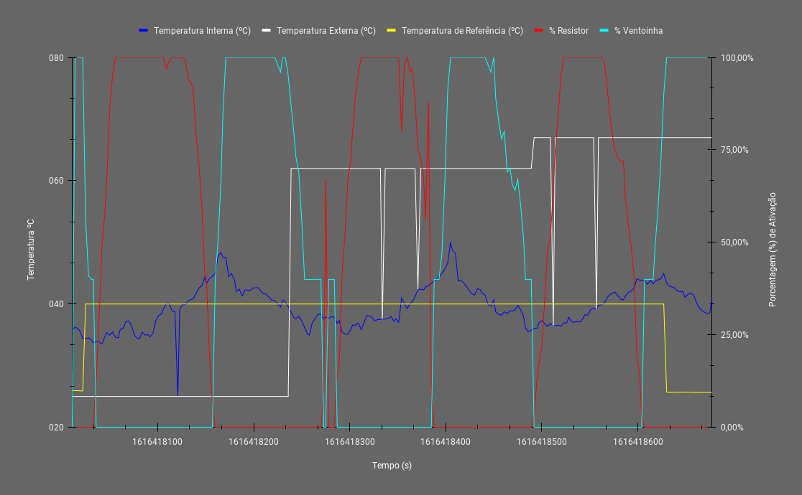

# Projeto 1

[Descrição do projeto](https://gitlab.com/fse_fga/projetos_2020_2/projeto-1-2020.2)

## Identificação
- Aluno: Guilherme Guy de Andrade
- Matrícula: 16/0123186

## Passos para execução
- Compilar o programa com o comando `make all`
- Executar o binário que estará na pasta `bin` ou executar o comando `make run`

## Controles do programa
- 'q' para sair
- 's' para definir a temperatura de referência, uma temperatura negativa irá definir o programa para a temperatura informada pelo sensor

## Experimento

Este é gráfico gerado a partir dos dados coletados durante a execução do programa:

O período de tempo é coletado no formato de segundos desde a Epoch do Linux, o que fornece tanto o dia, quanto a hora, em que tal evento ocorreu. Os dados puros podem ser conferidos no arquivo `docs/log.csv`

[Este link](https://docs.google.com/spreadsheets/d/e/2PACX-1vTQp8TVSkmhVAoUPqSzuEt8Sxtiuo0tmisl-uQDdpt7wPoRLFCgEkh2dBzIjhgWVtrXKUK1Quk_YaMz/pubchart?oid=1791777157&format=interactive) leva para uma versão interativa do gráfico.