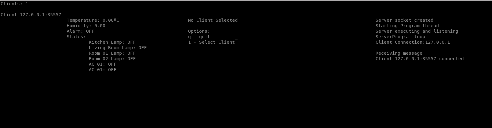

# Projeto 2

[Descrição do projeto](https://gitlab.com/fse_fga/projetos_2020_2/projeto-2-2020.2)

## Identificação
- Aluno: Guilherme Guy de Andrade
- Matrícula: 16/0123186

## Passos para execução

- Compilar código com comando make
- Para executar servidor:
    - ./bin/bin s *porta*
    - ex: `./bin/bin s 3000`

- Para executar cliente distribuido:
    - ./bin/bin s *ip_do_servidor* *porta_do_servidor*
    - *ip_do_servidor* deve estar corretamente formatado (ex: 127.0.0.1)
    - ex: `./bin/bin c 127.0.0.1 3000`

## Controles do programa

Apenas o servidor possui interface de usuário. Aperte o botão correspondente à opção para utilizá-la. A qualquer momento a aplicação pode ser encerrada utilizando `Ctrl + C`.

Para executar alguma opção em um cliente (como acionar o alarme ou alterar o estado de um dispositivo) é necessário selecionar o cliente primeiro.

## Screenshot da UI

